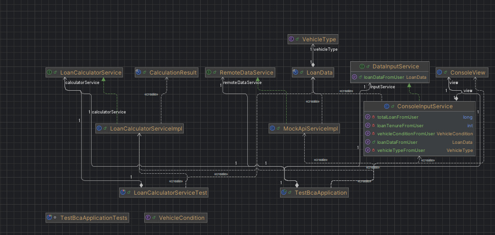

# Credit Simulator

Aplikasi konsol untuk menghitung cicilan bulanan pinjaman kendaraan berdasarkan aturan bisnis yang telah ditentukan.

## Fitur

-   Kalkulasi cicilan untuk Mobil atau Motor, dalam kondisi Baru atau Bekas.
-   Mendukung input interaktif dari pengguna melalui konsol.
-   Mendukung pemuatan data kalkulasi dari web service.
-   Struktur proyek berbasis MVC (Model-View-Controller).
-   Dilengkapi dengan CI/CD pipeline menggunakan GitHub Actions untuk deployment ke Docker Hub.

## Teknologi

-   Java 17
-   Maven
-   JUnit 5 (untuk testing)
-   Docker
-   GitHub Actions

## Prasyarat

-   Java 17 atau versi yang lebih tinggi.
-   Maven.

## Cara Menjalankan Aplikasi (Langkah demi Langkah)

1.  **Clone Repositori**
    ```bash
    git clone <url-repository-anda>
    cd test-bca
    ```

2.  **Build Proyek**
    Gunakan Maven Wrapper yang sudah tersedia untuk mem-build proyek. Ini akan mengunduh semua dependensi yang diperlukan.
    *   Di Windows:
        ```bash
        ./mvnw.cmd clean install
        ```
    *   Di macOS/Linux:
        ```bash
        ./mvnw clean install
        ```

3.  **Jalankan Aplikasi**
    Setelah proses build selesai, jalankan aplikasi menggunakan perintah berikut:
    ```bash
    java -cp target/classes;C:\Users\NAMA_USER\.m2\repository\org\json\json\20231013\json-20231013.jar com.testbca.TestBcaApplication
    ```
    *Catatan: Sesuaikan path ke file `json-20231013.jar` jika lokasi repositori Maven lokal Anda berbeda.*

    Anda akan masuk ke mode interaktif di mana Anda dapat memasukkan perintah.
    Perintah yang tersedia:
    -   `calculate`: Memulai kalkulasi baru secara interaktif.
    -   `load`: Memuat data dari web service dan menampilkan hasil.
    -   `show`: Menampilkan daftar perintah yang tersedia.
    -   `exit`: Keluar dari aplikasi.

## Cara Menjalankan Unit Test

Gunakan Maven untuk menjalankan semua unit test yang ada di dalam proyek.

*   Di Windows:
    ```bash
    ./mvnw.cmd test
    ```
*   Di macOS/Linux:
    ```bash
    ./mvnw test
    ```

## Alur CI/CD

Proyek ini menggunakan GitHub Actions untuk *Continuous Integration* dan *Continuous Deployment*.

1.  **Trigger**: Pipeline akan berjalan secara otomatis setiap kali ada `push` atau `pull_request` ke `main` branch.
2.  **Build & Test**: Workflow akan mengompilasi kode dan menjalankan seluruh unit test untuk memastikan kualitas kode.
3.  **Package & Deploy**: Jika build dan test berhasil, aplikasi akan di-package ke dalam sebuah image Docker dan diunggah ke Docker Hub.


